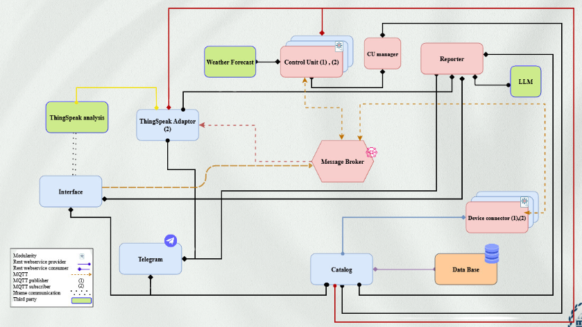

# 🌱 Smart Care – IoT-based Plant & Greenhouse Monitoring System  

  
  
  
  
  

---

## 🌍 Overview  
**Smart Care** is an **IoT project** designed to monitor and manage greenhouse and plant environments.  
The system integrates **sensors, cloud services, and a Telegram bot** for real-time monitoring, threshold alerts, and decision support.  

💡 Built for **ICT4SS @ Politecnico di Torino**.  

---

## ✨ Features  
✅ Real-time monitoring of **temperature, humidity, soil moisture**  
✅ Data collection via **MQTT & REST APIs**  
✅ **Telegram Bot** for instant alerts 📲  
✅ Data storage in **SQLite / ThingSpeak**  
✅ Modular **microservices architecture**  
✅ **Docker-ready** deployment 🐳  

---
## 📂 Repository Structure
```
.
├─ control_unit/         # Threshold logic & actuation rules   
├─ cu_manager/           # Control-Unit orchestrator / manager     
├─ device_connector/     # Sensor/device I/O (MQTT/REST adapters)   
├─ interface/            # UI or API interface layer   
├─ registry/             # Service/device registry (catalog)   
├─ reporter/             # Reports, exporters, scheduled jobs   
├─ telegram_bot/         # Telegram bot for alerts/commands   
├─ thingspeak/           # ThingSpeak integration module   
├─ README.md   
├─ docker-compose.yaml   # Multi-service setup   
├─ image.png             # Diagram/screenshot referenced in README   
└─ requirements.txt      # Python dependencies   
```

---

## ⚙️ Installation  

### 🔑 Requirements  
- Python **3.9+**  
- MQTT broker (e.g., **Mosquitto**)  
- SQLite or **ThingSpeak API**  
- Telegram Bot API Token  

### 🚀 Setup  
1. Clone the repository:  
   ```bash
   git clone https://github.com/<your-username>/smart_care.git
   cd smart_care
   ```
2. Install dependencies:  
   ```bash
   pip install -r requirements.txt
   ```
3. Configure environment variables:  
   - `BROKER_ADDRESS` → MQTT broker address  
   - `TELEGRAM_API_KEY` → Your bot token  
   - `DB_PATH` → SQLite database path  

4. Start the microservices (separate terminals or Docker).  

---

## 🌐 Usage Flow  
1. 🌡️ Sensors publish data → MQTT broker  
2. 🔗 **Device Connector** collects & stores data  
3. ⚖️ **Control Unit** checks thresholds  
4. 🤖 **Telegram Bot** sends alerts to the user  
5. 📊 Data stored & visualized in **ThingSpeak / DB**  

**Example Alert:**  
```
⚠️ Soil moisture is too low (20%). Please water the plants.
```

---

## 📸 Diagram  
*


---

## 🚧 Future Improvements  
- 🤖 AI-based irrigation predictions  
- 📡 Multi-channel alerts (Email, WhatsApp)  
- 🌍 Web dashboard for real-time monitoring  

---

## 👨‍💻 Authors  
- Dani Khalang
- Asal Malekshahi
- Elahe Fallahi 

**Supervisor**: Prof. Edoardo Patti  


---
💚 *“Smart Agriculture for a Sustainable Future”* 🌍
